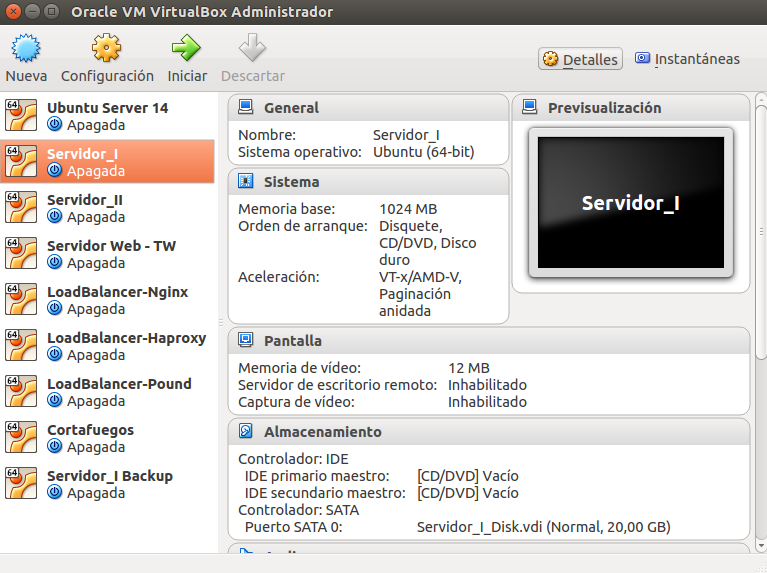
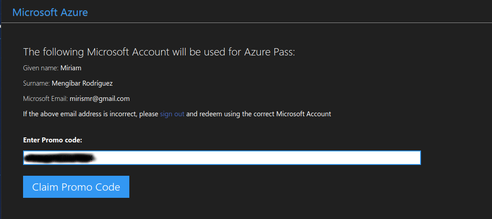
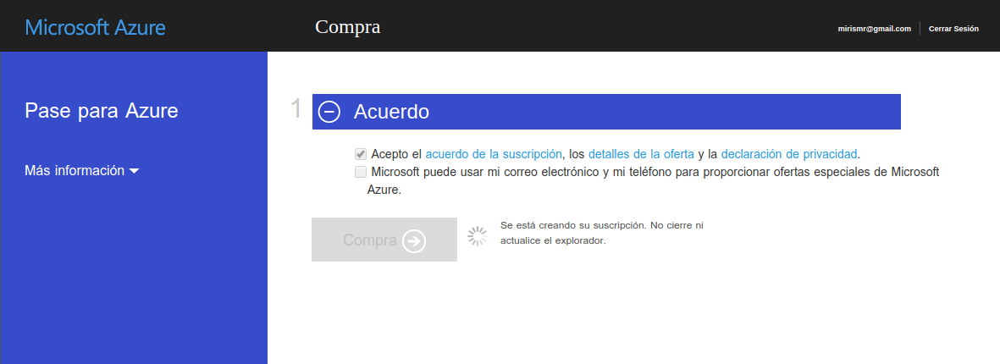
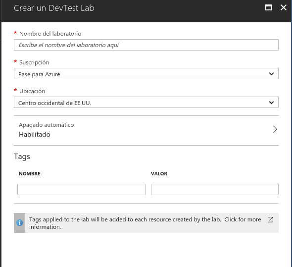

# Ejercicios tema 1

## Ejercicio 1: Consultar en el catálogo de alguna tienda de informática el precio de un ordenador tipo servidor y calcular su coste de amortización a cuatro y siete años.

Antes de nada debemos saber qué es y [cómo calcular una amortización](http://www.ennaranja.com/economia-facil/que-es-y-como-calcular-una-amortizacion/). En este caso supondremos que se trata de la sustitución de un bien a los 4 años y los 7 años, por lo que tendremos que dividir el valor del servidor (sin IVA) entre esos 4 y 7 años. Si consultamos la [tabla de amortizaciones simplificada](http://www.agenciatributaria.es/AEAT.internet/Inicio/_Segmentos_/Empresas_y_profesionales/Empresarios_individuales_y_profesionales/Rendimientos_de_actividades_economicas_en_el_IRPF/Regimenes_para_determinar_el_rendimiento_de_las_actividades_economicas/Estimacion_Directa_Simplificada.shtml), podemos ver que el coeficiente lineal máximo aplicable es de un 26% (en "Equipos para tratamiento de la información y sistemas y programas informáticos). En el caso de los 4 años supondrá aplicar un 25% y un 14,29% (aproximadamente) en el caso de los 7 años por lo que nos encontramos dentro del máximo aplicable. Para realizar este ejercicio, calcularemos la amortización a un [servidor](https://www.pccomponentes.com/hp-proliant-ml310e-g8-xe-e3-1220-8gb-2tb) de 796€ (635,54€ sin IVA).

Suponiendo que se adquieren el 1 de enero:

**Amortización a 4 años:**
Cuota de amortización: 158,89€ (redondeado hacia arriba)

| Año  | Amortización acumulada  | Valor  |
|:----:|:-----------------------:|:------:|
|1     |158,89€                  |476,65€ |
|2     |317,78€                  |317,76€ |
|3     |476,67€                  |158,87€ |
|4     |635,54€                  |0€      |

**Amortización a 7 años:**
Cuota de amortización: 90,79€ (redondeado hacia abajo)

| Año  | Amortización acumulada  | Valor  |
|:----:|:-----------------------:|:------:|
|1     |90,79€                   |544,75€ |
|2     |181,58€                  |453,96€ |
|3     |272.37€                  |363.17€ |
|4     |363,16€                  |272,38€ |
|5     |453,95€                  |181,59€ |
|6     |544,74€                  |90,8€   |
|7     |635,54€                  |0€      |

*(el valor del penúltimo año difiere un poco de la cuota de amortización por el redondeo)*

## Ejercicio 2: Usando las tablas de precios de servicios de alojamiento en Internet y de proveedores de servicios en la nube, Comparar el coste durante un año de un ordenador con un procesador estándar (escogerlo de forma que sea el mismo tipo de procesador en los dos vendedores) y con el resto de las características similares (tamaño de disco duro equivalente a transferencia de disco duro) en el caso de que la infraestructura comprada se usa sólo el 1% o el 10% del tiempo.

Los servidores que se van a analizar son los siguientes:

- [Cloud Next 1 (arsys)](https://www.arsys.es/servidores/cloud): 1vCPU, 1GB memoria RAM, 40GB SSD por 15 €/mes.

- [Cloud M (1and1)](https://www.1and1.es/servidor-cloud-dinamico#configuracion-del-servidor):
1vCore, 1GB memoria RAM, 50GB SSD por 0,014 €/hora

- Cloud M (1and1) facturación mensual: 1vCore, 1GB memoria RAM, 50GB SSD por 9,99 €/mes

- [t2.micro (amazon)](https://aws.amazon.com/es/ec2/pricing/):
1vCore, 1GB memoria RAM, almacenamiento EBS por 0,014$/hora

Suponiendo que los servidores se contratan durante un año (8760 horas):

- **Cloud Next 1:** 15 €/mes x 12 meses = 180€

- **Cloud M (facturación mensual):** 9,99 €/mes x 12 meses = 119,88€

Ambos tienen un precio fijo independientemente del uso.

- **Cloud M (facturación por hora y 1% de uso):** 8760 horas x 0,01 x 0,014€/hora = 1,23€

- **t2.micro (1% de uso):** 8760 horas x 0,01 x 0,014$/hora = 1,23$

- **Cloud M (facturación por hora y 10% de uso):** 8760 horas x 0,1 x 0,014€/hora = 12,26€

- **t2.micro (10% de uso):** 8760 horas x 0,1 x 0,014$/hora = 12,26$

Como podemos ver, resulta mucho más económico contratar los servidores por hora cuando no se va a realizar un uso completo de él. En el caso de que se usara el 100% del tiempo, el Cloud M con facturación mensual sería (aproximadamente) 3€ más económico que los servidores contratados por tiempo de uso.

## Ejercicio 3: En general, cualquier ordenador con menos de 5 o 6 años tendrá estos flags. ¿Qué modelo de procesador es? ¿Qué aparece como salida de esa orden? Si usas una máquina virtual, ¿qué resultado da? ¿Y en una Raspberry Pi o, si tienes acceso, el procesador del móvil?
Ejecutando la orden `cat /proc/cpuinfo` encontramos información acerca de nuestro procesador. En concreto, mi procesador es: Intel(R) Core(TM) i7-4500U CPU @ 1.80GHz.
La salida de la orden es la siguiente:

## Ejercicio 4
### 1. Comprobar si el núcleo instalado en tu ordenador contiene este módulo del kernel usando la orden `kvm-ok`.
Instalamos *cpu-checker* para poder ejecutar la orden. El resultado obtenido es el siguiente:

### 2. Instalar un hipervisor para gestionar máquinas virtuales, que más adelante se podrá usar en pruebas y ejercicios.
Tengo instalado de otras asignaturas *Virtualbox*.

## Ejercicio 5: Darse de alta en servicios de nube usando ofertas gratuitas o cupones que pueda proporcionar el profesor.
Nos dirijimos a la [siguiente página](windowsazurepass.com) para usar el cupón.

Introducimos el código correspondiente y aceptamos los términos, tal y como se muestra en las siguientes imágenes:

Una vez hecho esto, nos saldra una pantalla de espera en la que se nos informa que se esta procesando la suscripción. El proceso tarda unos minutos. Una vez que está listo, nos informan a través del correo por el cual nos mandan información sobre la suscripción (nombre e ID). En el portal de *Azure* podemos observar el estado de nuestra suscripción, así como caracerísticas de la misma:

## Ejercicio 6: Darse de alta en una web que permita hacer pruebas con alguno de los sistemas de gestión de nube anteriores.
Nos dirijimos a la página de [Azure DevTest Labs](https://azure.microsoft.com/en-us/services/devtest-lab/), y continuamos como *Free User*. Se nos redirigirá al portal de *Azure* del ejercicio anterior, donde podemos crear los test que necesitemos:
